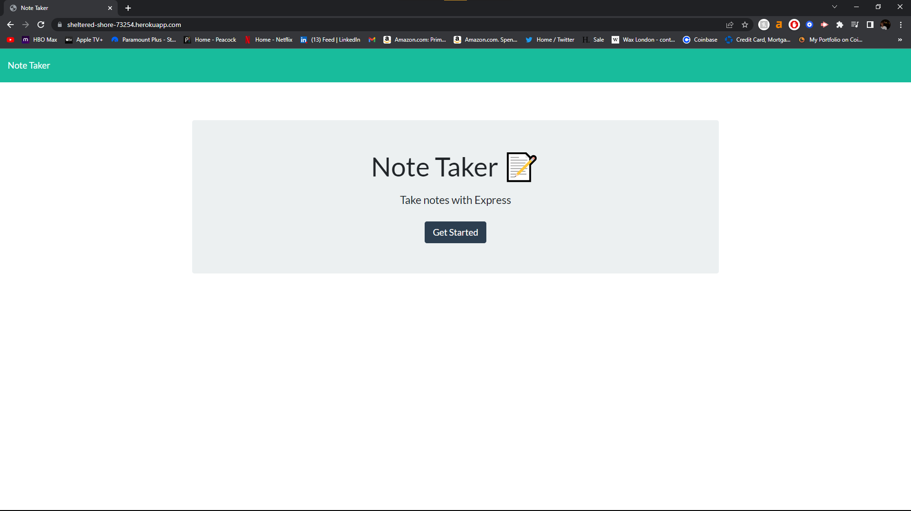

# 11 Express.js: Note Taker

## Table of Contents

[ Description ](#desc)

[ Installation ](#installation)

[ Usage ](#usage)

[ Questions ](#questions)

## 1. Description

This application was created using express js and allows you to configure notes with functions allowing you to save, add and remove notes.

## 2. Installation

N/A

## 3. Usage

https://sheltered-shore-73254.herokuapp.com/

Used to create notes in an efficient manner that also allows you to have them saved

## 4. Questions

Any questions or comments can be answered using the following

Email:
[anasqazza@gmail.com](mailto:anasqazza@gmail.com)

Github: [Aqazza](https://github.com/aqazza)
